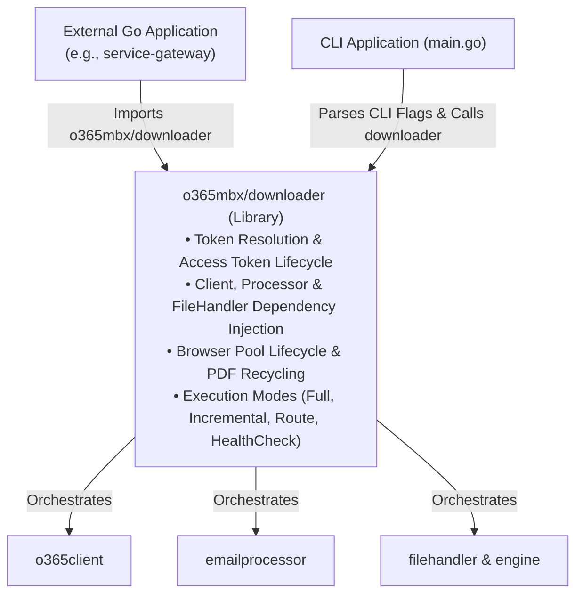
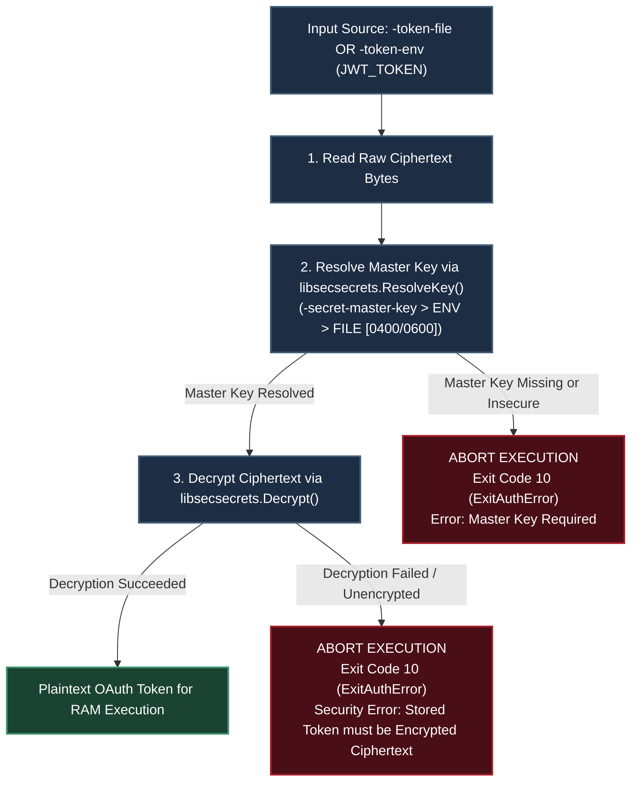

# o365mbx Application Architecture

The project `o365mbx` is a Go command-line application designed to download emails and attachments from Microsoft Office 365 mailboxes using the Microsoft Graph API. It prioritizes high-performance, concurrency, and robust error handling.

## Core Architecture and Components:

The application is structured into several modular Go packages, each with distinct responsibilities, promoting maintainability and scalability.

1.  **`main` package:**
    This is the application's entry point. It handles command-line argument parsing, loads and merges configuration from files and flags, sets up logging, and orchestrates the main `engine.RunEngine` execution. It also manages the application's context for graceful shutdown and securely loads the O365 access token.

2.  **`engine` package:**
    Contains the core business logic and orchestrates the entire email download process. It implements a highly parallelized producer-consumer architecture, manages concurrency using goroutines and channels, and tracks the overall state and statistics of the download run. It also includes logic for incremental processing and message routing.

3.  **`o365client` package:**
    Responsible for all interactions with the Microsoft Graph API. It handles constructing and executing HTTP requests, implements robust retry mechanisms with exponential backoff and client-side rate limiting, and parses API responses into Go-native data structures (`Message`, `Attachment`, etc.). It also manages folder creation and message movement within O365, and provides diagnostic health check statistics including folder-level item counts and storage sizes.

4.  **`filehandler` package:**
    Manages all local file system operations. This includes creating the unique workspace directory, saving processed email bodies and attachments, persisting the application's run state for incremental downloads, and writing metadata files. It incorporates security measures like filename sanitization, workspace path validation, and total path length checks. For secure file operations within the workspace, it uses Go 1.24+ `os.OpenRoot` to mitigate directory traversal and TOCTOU vulnerabilities.

5.  **`emailprocessor` package:**
    Focuses on transforming email body content. Its primary function is to convert HTML email bodies into clean plain text or PDF format. It uses a high-performance PDF conversion pipeline featuring a browser singleton and page pool for efficient resource management.

6.  **`apperrors` package:**
    Defines custom error types (`APIError`, `FileSystemError`) and sentinel errors (like `ErrMissingDeltaLink`) used throughout the application. This provides a structured way to categorize and handle different classes of errors, leading to clearer logging and more precise error recovery strategies.

7.  **`downloader` package:**
    Serves as the high-level Go library entry point. It encapsulates dependency injection, access token resolution (JWT string, file, or environment variable), browser pool lifecycles, and execution orchestration. This package allows `o365mbx` to be embedded directly as a library in external Go programs (such as `service-gateway`) without requiring subprocess invocation or duplicate boilerplate code.

## Library Integration (`o365mbx/downloader`):

`o365mbx` is designed as both a standalone CLI application and a reusable Go module. The core execution engine is decoupled from command-line argument parsing, allowing external Go microservices (e.g. `service-gateway`) to import and execute mailbox sync operations natively.

### Architecture Decoupling Diagram:



### Code Example: Embedding in External Services (`service-gateway`)

External Go applications can invoke mailbox downloads in **three lines of code** using the `downloader.Run` function, or gain granular control using `downloader.New`:

```go
package main

import (
	"context"
	"log"
	"os"

	"o365mbx/downloader"
	"o365mbx/engine"
)

func SyncMailbox(ctx context.Context, mailboxEmail, targetWorkspace, jwtToken string) error {
	cfg := &engine.Config{
		MailboxName:          mailboxEmail,
		WorkspacePath:        targetWorkspace,
		TokenString:          jwtToken,
		ProcessingMode:       "full",
		ConvertBody:          "pdf",
		ChromiumPath:         "ws://127.0.0.1:9222", // Shared Chrome daemon
		MaxParallelDownloads: 10,
	}

	// Option A: One-liner execution with default logger and stdout
	return downloader.Run(ctx, cfg)

	// Option B: Advanced control with custom output writer and logger
	// dl, err := downloader.New(cfg, customLogrusLogger)
	// if err != nil {
	//     return err
	// }
	// return dl.Execute(ctx, os.Stdout)
}
```

### Production Best Practices when Embedding as a Poller (e.g. in `service-gateway`)

When embedding `o365mbx/downloader` into a long-running microservice daemon to process a continuous influx of emails, implement the following architectural best practices:

1. **Continuous Incremental Mode (`ProcessingMode = "incremental"`)**:
   Always set `ProcessingMode: "incremental"` and specify a persistent `StateFilePath` (e.g., `/data/state/user_state.json`). On the first run, the library performs an initial sync and captures the Graph API `deltaLink`. On subsequent polling cycles, the engine reuses the `deltaLink` to query only new/modified emails, executing in under 100ms when no new messages exist.

2. **Continuous Polling Loop Pattern with Context Cancellation**:
   Wrap the poller loop in a `time.Ticker` select block that respects `ctx.Done()`. Log or handle non-fatal transient errors per iteration without crashing the daemon loop:

   ```go
   func StartMailboxPoller(ctx context.Context, cfg *engine.Config, pollInterval time.Duration) {
       ticker := time.NewTicker(pollInterval)
       defer ticker.Stop()

       for {
           select {
           case <-ctx.Done():
               log.Println("Stopping mailbox poller daemon...")
               return
           case <-ticker.C:
               if err := downloader.Run(ctx, cfg); err != nil {
                   log.Printf("Poller iteration warning (retrying next interval): %v", err)
               }
           }
       }
   }
   ```

3. **Shared Chrome Daemon Connection (`ChromiumPath`)**:
   For PDF conversions under high email volume, set `ChromiumPath: "ws://127.0.0.1:9222"`. Connecting directly to an external Chrome daemon via DevTools WebSocket avoids launching new browser processes on every polling cycle and significantly reduces CPU and memory overhead.

4. **Per-Message Timeout Guard (`MaxExecutionTimeMsg`)**:
   Configure `MaxExecutionTimeMsg: 120` (or appropriate timeout seconds) to guarantee that a corrupted, massive HTML, or recursively nested email attachment will never stall a worker goroutine or freeze the polling loop.

5. **Atomic State File Safety**:
   `filehandler` uses atomic write-and-rename (`state.json.tmp` ➔ `state.json`) inside `filepath.Dir(stateFilePath)`, ensuring that state files cannot be corrupted even if the host service or container experiences sudden restart.

---

## JWT Stored Token Security (`secretprotector` Integration):

### Zero-Trust Credential Security Policy

`o365mbx` mandates that sensitive credentials stored at rest (`-token-file` or `-token-env` / `JWT_TOKEN`) **MUST** be encrypted using AES-256-GCM authenticated encryption via the `secretprotector` library (`libsecsecrets`). Unencrypted plaintext tokens stored in files or static environment variables are strictly prohibited and rejected at runtime.

### Master Key Security & OS Enforcement
- **Linux/Unix**: Master key files must strictly enforce owner-only permissions (`0400` or `0600`). Key files with broad permissions (e.g., `0644` or `0777`) are automatically rejected.
- **Windows**: Master key files must not reside in shared or volatile system directories (such as `Public`, `\Temp\`, or `/temp/`).
- **Memory Scrubbing**: Sensitive cryptographic key buffers in RAM are zeroed out via `libsecsecrets.ZeroBuffer` immediately after O365 client initialization.

### 1. Security Boundaries: Stored vs. Streamed Secrets

| Secret Category | CLI Flags / Sources | Security Requirement | Handling Mechanism |
| :--- | :--- | :--- | :--- |
| **Stored Secrets (At Rest)** | `-token-file`, `-token-env` (`JWT_TOKEN`) | **Mandatory AES-256-GCM Encryption** | Processed through `libsecsecrets.Decrypt()`. Unencrypted stored tokens are rejected immediately with exit code `10` (`ExitAuthError`). |
| **Streamed Secrets (In RAM)** | `-token-string` | In-Memory Ephemeral Execution | Streamed dynamically into RAM at runtime. Bypasses disk decryption and is scrubbed from memory on completion. |

---

### 2. Master Key Resolution & Precedence Architecture

To decrypt stored token ciphertexts, `secretprotector` resolves a 32-byte master key (`libsecsecrets.ResolveKey`) using a strict precedence hierarchy:

1. **`-secret-master-key` (CLI Flag / Config)**: Direct 64-character hex key override (Highest Precedence).
2. **`-secret-master-key-env` (Environment Variable)**: Name of the environment variable storing the hex key (Defaults to `SECRETPROTECTOR_MASTER_KEY`).
3. **`-secret-master-key-file` (File Path)**: Path to a file containing the 64-character hex key (Lowest Precedence).

#### OS-Level File Security Enforcement:
* **Linux/Unix**: The key file **must** strictly enforce owner-only permissions (`0400` or `0600`). Files with `0644` or `0777` permissions are rejected with `libsecsecrets.ErrInsecurePermissions`.
* **Windows**: The key file **must not** reside in shared or volatile system locations (such as `Public`, `\Temp\`, or `/temp/`). Files in these paths are rejected with `libsecsecrets.ErrInsecureLocation`.

---

### 3. Enforced Decryption Pipeline Diagram



---

### 4. Memory Safety & Buffer Zeroing

To minimize the exposure window of sensitive cryptographic keys in memory:
* Immediately after decryption, `libsecsecrets.ZeroBuffer([]byte(masterKey))` fills the master key byte slice with zeros.
* Transient byte slices used during decryption are managed via `sync.Pool` and zeroed out before being returned to the pool.

---

## Key Design Principles:

*   **Modularity:** Clear separation of concerns across packages for better organization and testability.
*   **Resilience:** Robust error handling, retry mechanisms, and rate limiting to withstand transient failures and API throttling.
*   **Performance:** Leverages Go's concurrency features for efficient, parallel processing and optimized data transfer using streaming I/O.
*   **Configurability:** Flexible configuration options via command-line flags and JSON files, allowing users to tailor behavior without code changes.
*   **Security:** Proactive measures for safe file system interactions, including workspace validation and filename sanitization.

## Concurrency Model (Producer-Consumer Architecture):

The application employs a sophisticated producer-consumer pattern using Go's goroutines and channels to maximize throughput and efficiently handle large volumes of data.

*   **Producer (`o365client.GetMessages`):** A single goroutine responsible for fetching messages from the O365 Graph API. It handles pagination and filters messages based on the last run timestamp for incremental processing. Fetched messages are sent to the `messagesChan`.

*   **Processors (Multiple Goroutines):** A pool of goroutines (number controlled by `MaxParallelDownloads`) that read messages from `messagesChan`. Each processor first saves the message body and metadata. Then, if the message `hasAttachments`, it makes a separate API call to fetch the list of attachments for that specific message. It then dispatches individual `AttachmentJob`s to the `attachmentsChan`. This two-phase approach (fetch message, then fetch attachments) improves reliability and reduces memory consumption.

*   **Downloaders (Multiple Goroutines):** Another pool of goroutines that consume `AttachmentJob`s from `attachmentsChan`. Each downloader is responsible for saving the attachment content (which is fetched with the attachment list) to the file system and updating the message's metadata.

*   **Aggregator (Single Goroutine, in "route" mode only):** A dedicated goroutine that receives `ProcessingResult`s from both processors and downloaders via `resultsChan`. It tracks the completion status of each message (ensuring both body and all attachments are processed). Once a message is fully processed, the aggregator moves the original message in O365 to either a "Processed" or "Error" folder based on the outcome.

*   **Channels (`messagesChan`, `attachmentsChan`, `resultsChan`):** Act as buffered queues, facilitating safe and efficient communication between different stages of the pipeline.

*   **`sync.Map` for State Management:** The engine uses a `sync.Map` to safely track the download state of each message being processed concurrently. This provides a scalable and efficient way to manage state without the bottleneck of a single global mutex.

*   **`sync.WaitGroup`:** Used to synchronize the completion of all producer, processor, downloader, and aggregator goroutines, ensuring the application exits gracefully only after all tasks are done.

*   **Semaphore (`chan struct{}`):** Implemented as a buffered channel, this mechanism limits the total number of concurrent processor and downloader goroutines actively working, preventing resource exhaustion and allowing fine-grained control over parallelism.

## High-Performance PDF Conversion

The application implements an optimized pipeline for HTML-to-PDF conversion, following production-grade best practices for the `go-rod` library:

*   **Browser Singleton**: A single Chromium instance is launched at startup and shared across the entire application lifecycle, eliminating the heavy overhead of repeated process creation.
*   **Page Pool**: A managed pool of browser pages (tabs) limits concurrent rendering tasks, preventing CPU and memory spikes while maximizing resource utilization.
*   **Session Isolation**: Every render occurs in a fresh incognito context to prevent session pollution, CSS leaks, or cookie persistence between different emails.
*   **Memory Management (Recycling)**: To prevent long-term memory creep typical of Chromium, the browser instance is automatically recycled after every 1,000 conversions.
*   **Asset Synchronization**: The system uses `SetDocumentContent` combined with `WaitIdle` to ensure all external assets (images, styles) are fully loaded before capturing the PDF.

## Robustness and Error Handling:

The application is designed to be highly resilient against network issues, API limitations, and file system errors.

*   **Per-Message Execution Timeout**: A `context.WithTimeout` is applied to each message in the processor pool. This ensures that a single problematic email (e.g., massive HTML or recursive attachments) cannot block a worker indefinitely. If the timeout is reached, the message's context is cancelled, and the aggregator routes it to the "Error" folder.

*   **Custom Error Types:** The `apperrors` package defines custom error types like `APIError`, `FileSystemError`, and `ErrMissingDeltaLink`. these types allow the application to distinguish between different error sources, enabling more specific logging, user feedback, and programmatic error handling.

*   **Built-in Retry Mechanism:** The application leverages the Microsoft Graph SDK's built-in retry middleware. This automatically retries failed requests (e.g., due to network glitches or server-side errors like HTTP 5xx) using an exponential backoff strategy. The number of retries and backoff duration are configurable.

*   **Client-Side Rate Limiting:** To prevent hitting O365 Graph API throttling limits, the `o365client` is configured with client-side rate limiters (`APICallsPerSecond`, `APIBurst`). This proactively paces API requests, ensuring the application remains a good API citizen.

*   **Context Cancellation:** A `context.Context` is propagated throughout the application's goroutines. This allows for graceful shutdown when an interrupt signal (e.g., `Ctrl+C`) is received, ensuring that ongoing operations are cancelled cleanly and resources are released.

*   **Reliable Incremental Sync:** The application has specific logic to ensure the correctness of incremental downloads. If the Graph API fails to provide a `deltaLink` at the end of a sync, the application treats this as a fatal error (`apperrors.ErrMissingDeltaLink`) and terminates. This prevents silent failures that would cause the next run to re-download all data.

*   **Graceful Shutdown and State Logging:** Upon shutdown, the application logs any messages that were still in the processing pipeline. This provides visibility into incomplete work and prevents silent data loss.

*   **Workspace Validation and Security:** The `filehandler` package includes robust validation for the `workspacePath`. It ensures the path is absolute, prevents the use of critical system directories, and checks that the workspace is a legitimate directory (not a symbolic link). Filenames are sanitized to prevent path traversal attacks, and total path length is checked to avoid filesystem errors. For secure file operations within the workspace, it uses Go 1.24+ `os.OpenRoot` to mitigate directory traversal and TOCTOU vulnerabilities.

*   **Bandwidth Limiting:** An optional `bandwidthLimiter` in `filehandler` allows users to cap the download speed of attachments, which can be useful in environments with limited network capacity.

## Complex Attachment Processing (ItemAttachments)

The application features advanced handling for "ItemAttachments" (nested emails, often `.msg` or `.eml` files). This logic is encapsulated within the `filehandler` package and is designed to handle the complexities of MIME structures while maintaining performance and security.

### 1. Attachment Type Identification
The system distinguishes between `FileAttachment` (standard files) and `ItemAttachment` (nested messages).
*   **FileAttachments**: Saved directly using content bytes.
*   **ItemAttachments**: Processed using the Microsoft Graph API `$value` endpoint to retrieve the raw MIME (RFC 822) stream, ensuring the original message structure is preserved.

### 2. Processing Modes
The `msgHandler` configuration (set via `-msg-handler` flag or `config.json`) determines the processing depth:
*   **`raw` (Default)**: The nested message is saved as a single `.eml` file. This is the most performance-efficient mode and preserves the original artifact without modification.
*   **`extractor`**: Triggers a deep-dive into the attachment content using the `enmime` library.

### 3. Extractor Logic and Specifications
When in `extractor` mode, the following architectural specifications apply:
*   **MIME Parsing**: The saved `.eml` is re-opened and parsed into a MIME envelope.
*   **Body Extraction**: The message body of the attached email is extracted. The system prioritizes HTML but falls back to plain text if HTML is unavailable. Extracted bodies are saved with an `_extracted.html` (or `.txt`) suffix.
*   **One-Level Nesting Limit**: To prevent infinite recursion and excessive resource usage, the extractor only processes **one level** of nested attachments. Any attachments found *inside* the attached email are saved to the main `attachments` folder but are not further extracted.
*   **Deterministic Naming**: 
    *   Extracted bodies use the format: `%02d_%s_extracted.html`.
    *   Nested attachments use the format: `%02d_%d_%s` (where `%d` is a sub-sequence number).

### 4. Security and Resource Management
*   **Preservation**: The original raw `.eml` file is always saved, even when extraction occurs, providing a verifiable audit trail.
*   **Streaming**: Data is streamed from the API to disk where possible to minimize memory overhead.
*   **Error Resilience**: If MIME parsing fails, the system logs a warning and proceeds with the raw file, ensuring that one corrupted attachment does not halt the entire processing pipeline.

## Configuration Management:

The application offers flexible configuration options to adapt to various environments and user preferences.

*   **`engine.Config` Struct:** All configurable parameters are defined in a single `Config` struct within the `engine` package, providing a centralized and type-safe configuration model. Sensible default values are set for all parameters.

*   **Configuration Hierarchy:** Configuration values are loaded with a clear precedence:
    1.  **Defaults:** Initial values are set by `cfg.SetDefaults()`.
    2.  **JSON Configuration File:** An optional JSON file (specified by the `-config` flag) can override default values.
    3.  **Command-Line Flags:** Command-line arguments provide the highest precedence, allowing users to override any values set by defaults or the config file.

*   **Validation (`cfg.Validate()`):** After loading and merging all configuration sources, the `Validate()` method is called to ensure that all parameters are logically sound and within acceptable operational ranges (e.g., positive numbers for timeouts, valid processing modes). This prevents runtime errors due to misconfigurations.

## Performance and Parallelism Tuning:

The `MaxParallelDownloads` setting, controlled by the `-parallel` flag or `maxParallelDownloads` in the config file, is central to the application's performance.

### Definition
The `parallel` flag in `o365mbx` controls the `MaxParallelDownloads` configuration setting.

### Role of the `-parallel` flag:
**Concurrency Limit:** It determines the maximum number of concurrent workers (goroutines) that will process messages and download attachments simultaneously.

1.  **Command-line flag:**
    ```bash
    ./o365mbx -mailbox "user@example.com" -workspace "/path/to/output" -token-env -parallel 20
    ```

2.  **Configuration file (JSON):**
    You can include `maxParallelDownloads` in your JSON configuration file.

    Example `config.json` snippet:
    ```json
    {
      "mailboxName": "user@example.com",
      "workspacePath": "/path/to/your/output",
      "maxParallelDownloads": 15,
      "apiCallsPerSecond": 4.0
    }
    ```
    Then, run the application referencing this config file:
    ```bash
    ./o365mbx -config "/path/to/your/config.json"
    ```

### Recommendation:
*   The default value is 10.

## How to Adjust to Not Trigger O365 Graph API Throttling:

Adjusting the application's parameters to avoid O365 Graph API throttling requires a holistic approach, considering not just the number of concurrent operations but also the rate at which API requests are made.

Here are the best practices:

1.  **Understand Graph API Throttling:** Microsoft Graph API implements throttling to ensure service health and fair usage. When limits are exceeded, the API returns HTTP 429 (Too Many Requests) responses, often with a `Retry-After` header.

2.  **The Role of `-parallel` in Throttling:** While `-parallel` controls local concurrency, a high value can indirectly lead to more frequent API calls, increasing the risk of throttling if not balanced with rate limiting.

3.  **Key Configuration Flags for Throttling Prevention:**
    *   **`-api-rate` (`apiCallsPerSecond`):** Directly controls the maximum number of API calls per second the client will make. This is the primary mechanism for client-side rate limiting.
    *   **`-api-burst` (`apiBurst`):** Defines the maximum "burst" of API calls allowed in quick succession before the `-api-rate` limit is strictly enforced. This allows for initial spikes in activity without immediate throttling.
    *   **`-max-retries` (`maxRetries`):** Configures how many times the application will retry a failed API request (including 429s and 5xxs).
    *   **`-initial-backoff-seconds` (`initialBackoffSeconds`):** Sets the starting delay for exponential backoff during retries.

    *   **Start Conservatively:** Begin with lower values for `-parallel`, `-api-rate`, and `-api-burst`. The default values (`-parallel 10`, `-api-rate 5.0`, `-api-burst 10`) are a good starting point.
    *   **Monitor Logs:** Closely monitor application logs for warnings or errors related to HTTP 429 responses or excessive retries.
    *   **Iterative Adjustment:** Gradually increase `-parallel`, `-api-rate`, and `-api-burst` while monitoring performance and throttling responses. Find the optimal balance that maximizes download speed without triggering frequent throttling.

By systematically adjusting these parameters and closely monitoring the application's behavior and logs, you can find an an optimal balance that maximizes download speed while minimizing the risk of O365 Graph API throttling.
