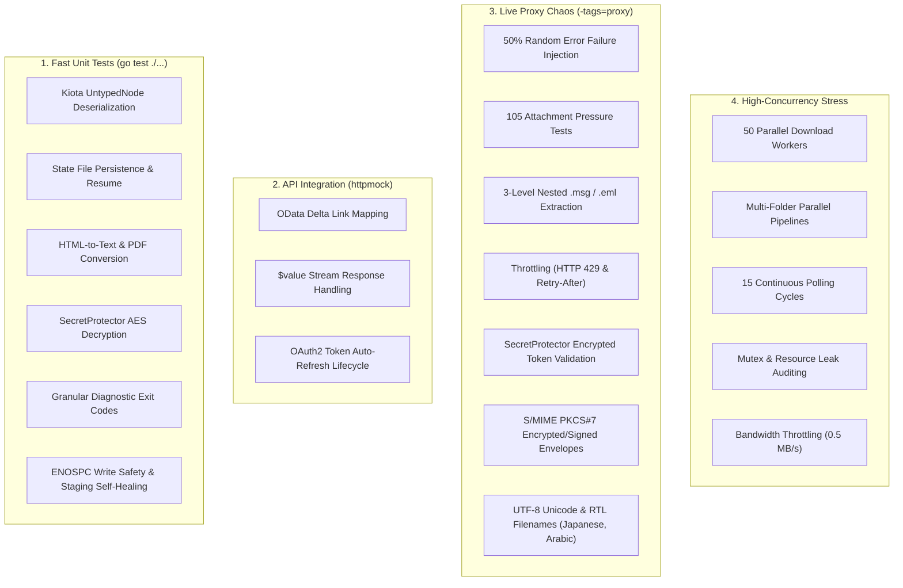

# TESTING.md - O365 Mailbox Downloader Testing Strategy

This document provides technical details, requirements, execution procedures, and coverage matrices for the `o365mbx` test suite.

---

## 1. Architecture of the Test Suite

We employ a **Layered Testing Strategy** to isolate logic, validate integrations, ensure resilience, and stress-test performance.



### Layer A: Unit Testing (Logic & Coordination)
- **Tooling**: Standard `testing` package + `go.uber.org/mock` (formerly `uber-go/mock`).
- **Objective**: Verify business rules, state file persistence, Kiota untyped node unwrapping (`UntypedNumber`/`UntypedNode`), and producer-consumer orchestration in `engine`.
- **Technical Requirement**: All core components (`O365Client`, `FileHandler`, `EmailProcessor`) implement clean interfaces.
- **Mock Generation**: Controlled via `//go:generate` comments. Run `go generate ./...` to update.

### Layer B: Integration Testing (API & Transport)
- **Tooling**: `github.com/jarcoal/httpmock`.
- **Objective**: Validate interactions with Microsoft Graph API without making external network calls.
- **Technical Requirement**: Inject a custom `msgraphsdk.GraphRequestAdapter` into the `O365Client`.
- **Key Scenarios**: `$value` stream responses, OData delta links, and complex JSON attachment structures.

### Layer C: Resilience & Chaos Testing (Real-World Network & Realistic Data)
- **Tooling**: **Microsoft Dev Proxy** (`http://127.0.0.1:8000`).
- **Objective**: Test how the application handles rate-limiting (`429 Too Many Requests`), service unavailability (`503 Service Unavailable`), gateway timeouts (`504`), high latency, and complex MIME structures.
- **Technical Requirement**: Requires the `proxy` build tag (`-tags=proxy`). Automatically managed by native Go test lifecycle.
- **Implementation Pattern**: Invokes the full `RunEngine` pipeline (Engine -> Client -> FileHandler) under 50% failure rates.
- **Data Hygiene**: All generated test data is isolated via `t.TempDir()` to maintain workspace cleanliness and automatic cleanup.
- **Validation Depth**: Beyond file existence, tests inspect extracted content (e.g., verifying unique canary strings in nested `.msg` / `.eml` attachments).

### Layer D: High-Concurrency Stress Testing (Performance & Hardening)
- **Tooling**: Live Dev Proxy + Go Concurrency Utilities (`sync.WaitGroup`, Semaphore Channels).
- **Objective**: Stress worker pools, semaphore locks, file handle bounds, and goroutine leak safety under heavy load.
- **Key Scenarios**: 50 concurrent download workers (`100 req/s`, `200 burst`), parallel multi-folder pipeline execution (`Inbox`, `Archive`, `Sent`), and 10 rapid back-to-back engine runs.

---

## 2. Technical Requirements & Setup

### Environment Dependencies
- **Go**: 1.21 or higher.
- **Mockgen**: `go install go.uber.org/mock/mockgen@latest`.
- **Dependencies**: Run `go mod tidy` to ensure `testify`, `httpmock`, and `gomock` are available.
- **Dev Proxy**: Required for Resilience & Stress tests. Auto-located via `%PROXY_HOME%`, `$PATH`, `d:\inetd\devproxy\devproxy.exe`, or standard OS paths.

### Environment Variables
Optionally set these variables to customize binary and workspace locations:
```powershell
# Windows PowerShell
$env:PROXY_HOME = "d:\inetd\devproxy"
```
```bash
# Linux / macOS Bash
export PROXY_HOME="/opt/devproxy"
```

### Zero-Config Cross-Platform Dev Proxy Auto-Management
The resilience test suite automatically manages the Microsoft Dev Proxy process across Windows, Linux, and macOS:
1. **Auto-Discovery**: Locates `devproxy` / `devproxy.exe` across `%PROXY_HOME%`, `$PATH`, `d:\inetd\devproxy\devproxy.exe`, and `/home/user/.config/devproxy/devproxy`.
2. **Auto-Start**: Automatically launches Dev Proxy with `testdata/resilience-full-pipeline.json` if not already running.
3. **Responsive Polling**: Polls `https://graph.microsoft.com/v1.0/me` until Dev Proxy is responsive.
4. **Deadlock-Free Clean Shutdown**: `TestMain(m *testing.M)` and `t.Cleanup()` issue a REST shutdown request to `http://127.0.0.1:8897/proxy/stopProxy` and force-kill the process cleanly.
5. **Cross-Platform Fixtures**: All `@` file mock references in `resilience-full-pipeline.json` use relative paths (`@fixtures/nested_recursion.eml`) relative to the mock file, ensuring 100% portability.

---

## 3. Live Dev Proxy Mock Specifications (`resilience-full-pipeline.json`)

The live Dev Proxy test suite relies on `tests/resilience-full-pipeline.json` to simulate complex Graph API payloads and endpoints deterministically. Below is the complete specification table for all mocked test scenarios, their engineering justifications, and acceptance criteria:

| Mock ID / Endpoint | Test Description & Real-World Condition | Engineering Justification | Acceptance Criteria |
| :--- | :--- | :--- | :--- |
| **`msg-chaos`** | Baseline text email without attachments. | Establishes normal pipeline baseline under 50% proxy chaos without attachment overhead. | `RunEngine` processes message, creating `body.txt` and `metadata.json` cleanly. |
| **`msg-null-subject`** | Moderna Accounts Payable email with `"subject": null` (`ACCOUNTSPAYABLE@MODERNATX.COM`). | Resolves March 2026 Issue #3 (`panic: SIGSEGV` on `(No subject)` emails). | `utils.StringValue` dereferences `nil` safely; saves subject as `""` / `(No subject)` without crash. |
| **`msg-null-sender`** | System bounce / NDR message with `"from": null`. | Prevents null pointer crashes on automated system messages or bounce notifications. | Sender email falls back safely to `"unknown_sender"`. |
| **`msg-unnamed-attachment`** | Email attachment where Graph API returns `"name": null`. | Prevents null pointer crashes and invalid path errors when Graph API omits attachment filenames. | Generates safe fallback filename (`unnamed_attachment.dat`) and saves binary content. |
| **`msg-html-rich`** | Newsletter email with rich HTML markup (`<h1>`, `<style>`), inline images (``), and HTML entities (`&amp;`, `&lt;`, `&gt;`). | Verifies `emailprocessor.go` HTML-to-text conversion and entity decoding. | HTML markup and scripts stripped; entities decoded into readable `.txt` body file. |
| **`msg-filename-collisions`** | Email with 3 separate attachments all identically named `invoice.pdf`. | Verifies `filehandler.getUniqueFilePath` filename deduplication under concurrent downloads. | Attachments saved as `invoice.pdf`, `invoice_1.pdf`, and `invoice_2.pdf` without overwriting or error. |
| **`msg-inline-cid`** | Email with embedded HTML signature image (`isInline: true`, `contentId: "logo.png"`). | Verifies inline attachment separation based on `-download-inlines` setting. | Inline attachment extracted or filtered according to `AttachmentExtractionL1` configuration. |
| **`msg-nested`** | Arthrex AP email (`AP@Arthrex.com`) containing an attached `.msg` Outlook item (`#microsoft.graph.itemAttachment`). | Resolves March 2026 Issue #1 where attached `.msg` / `.eml` items were skipped. | ItemAttachment extracted via raw RFC822 MIME stream (`@fixtures/nested_recursion.eml`); Level 1 files extracted. |
| **`msg-massive`** | McKesson MMSAR email (`mmsar@mckesson.com`) with 105 PDF file attachments. | Resolves March 2026 Issue #4 (high attachment timeouts & worker pool pressure). | All 105 attachments saved without memory leaks, deadlocks, or worker pool starvation. |
| **`msg-kitchen-sink`** | Complex email containing 51 mixed attachments (PDFs, images, `.eml`, `.msg`, text). | Stress-tests multi-type attachment dispatch and metadata aggregation. | All 51 attachments extracted and recorded accurately in `metadata.json`. |
| **`msg-hi-fi`** | High-fidelity email with special symbol filenames (`!@#$%^&()_+-=[]{}`), spaces, and zero-byte files. | Tests filename sanitization (`filehandler.SanitizeFileName`) and zero-byte file I/O safety. | Special symbols sanitized to OS-safe characters; zero-byte files written cleanly. |
| **`msg-recursive`** | Multi-level recursive MIME email containing a nested `.eml` which itself contains an attachment. | Verifies deep MIME tree traversal and recursive extraction (`@fixtures/recursive_1.eml`). | Level 1 and Level 2 nested attachments extracted and canary strings verified. |
| **`msg-concurrency-01` .. `20`** | 20 individual concurrent messages queued simultaneously. | Tests pipeline worker pool synchronization, channel backpressure, and rate limiting. | All 20 messages processed concurrently without race conditions or dropped jobs. |
| **`msg-deleted-01` (`@removed`)** | Delta sync item marked with `@removed: {"reason": "deleted"}`. | Verifies Graph API incremental delta sync handling of soft-deleted mailbox items. | `o365client.GetMessages` processes soft-deletions cleanly without throwing OData errors. |
| **`GET /users/*/mailFolders*`** | Mailbox folder list endpoint returning `Inbox`, `Archive`, `Sent` with `sizeInBytes`. | Verifies `GetMailboxHealthCheck` and folder size calculation (`UntypedNumber` unwrapping). | Returns folder list and calculates total mailbox size in MB. |
| **`POST /users/*/messages/*/move*`** | Message move endpoint returning `201 Created`. | Verifies `-processing-mode route` Graph API message relocation. | Returns successful move response; engine updates job stats to routed. |
| **`GET /users/*/mailFolders/*/messages*`** | Folder messages stream endpoint. | Verifies `-healthcheck` inbox last message date lookup and `-processing-mode details`. | Returns latest message in folder for presenter tabwriter display. |

---

## 4. Complete List of Tests

### Unit Tests (`go test ./...`)

| Logical Group | Test Name | Technical Purpose | Success Criteria |
| :--- | :--- | :--- | :--- |
| **Engine** | `TestRunEngine_Basic` | Verify `full` mode pipeline orchestration. | Producer -> Processor -> Handler sequence completes for 1 message. |
| | `TestRunEngine_Incremental` | Validate `RunState` (Delta Link) lifecycle. | `LoadState` -> API Call with Delta -> `SaveState` with new Delta. |
| | `TestRunEngine_RouteMode` | Test `Aggregator` and `MoveMessage` logic. | Message is moved to `ProcessedFolder` on success, `ErrorFolder` on failure. |
| | `TestRunEngine_WithAttachments` | Verify multi-stage attachment download. | `GetMessageAttachments` -> `SaveAttachmentFromBytes` -> `WriteAttachmentsToMetadata`. |
| | `TestRunEngine_GetMessagesError` | Verify engine exit on producer failure. | Engine returns non-nil error if `GetMessages` fails. |
| | `TestRunEngine_SaveMessageError` | Verify engine handles storage failures. | Engine handles and returns errors if `SaveMessage` fails. |
| | `TestRunEngine_AggregatorLogic` | Test internal aggregation pipelines. | Messages correctly flow through aggregator to final folder. |
| | `TestRunEngine_AggregatorError` | Logic: Aggregator failure handling. | Verifies that message failures trigger `SaveError` and update job stats. |
| | `TestRunEngine_MessageTimeout` | Hardening: Message execution timeout. | Verifies that messages exceeding `MaxExecutionTimeMsg` are moved to the `ErrorFolder`. |
| | `TestValidateWorkspacePath` | Security: Prevent path traversal/escapes. | Rejects relative paths, symlinks, and root-level system directories. |
| | `TestValidateWorkspacePath_Extra` | Hardening: Varied workspace scenarios. | Handles critical paths, existing files, and non-empty directories. |
| | `TestRunEngine_ValidationFail` | Logic: Workspace validation failure. | RunEngine exits early if workspace path is invalid. |
| | `TestRunEngine_CreateWorkspaceFail` | Logic: Workspace creation failure. | RunEngine handles errors from FileHandler.CreateWorkspace. |
| | `TestRunEngine_GetMailboxStatsFail` | Logic: Non-fatal stat failure. | Engine continues if initial mailbox stats retrieval fails. |
| | `TestRunEngine_SaveStatusReportFail` | Logic: Non-fatal report failure. | Engine logs but does not exit if status report generation fails. |
| | `TestRunDownloadMode_LoadStateFail` | Logic: State loading error. | runDownloadMode exits if incremental state cannot be loaded. |
| | `TestRunDownloadMode_IncrementalMode_StateAndErrorPersistence` | Logic: Incremental state & error persistence. | Verifies state file loading, context execution, and error.json persistence on failure. |
| | `TestRunDownloadMode_SourceFolderFail` | Logic: Folder lookup failure. | runDownloadMode exits if custom source folder cannot be found/created. |
| | `TestRunDownloadMode_AttachmentFetchErr` | Logic: Attachment discovery failure. | Handled as a non-fatal error; message moved to Error folder. |
| | `TestRunDownloadMode_QueuingTimeout` | Hardening: Context cancellation race. | Verified that queuing is interrupted safely during message timeouts. |
| | `TestRunDownloadMode_FinalMetadataError` | Logic: Post-download metadata failure. | Verifies that metadata write errors are captured and reported. |
| | `TestRunDownloadMode_FullMode_AttachmentContextAndErrorPersistence` | Logic: Full sync attachment & error state. | Verifies non-canceled context and error.json logging in full mode. |
| | `TestRunDownloadMode_SaveStateFail` | Logic: State save failure. | Handles state file save failure gracefully. |
| | `TestValidateWorkspacePath_IOErrors` | Hardening: IO error handling. | Handles directory read / stat permission errors. |
| | `TestRunAggregator_FolderCreationFail` | Logic: Aggregator setup failure. | Aggregator exits if destination folders cannot be resolved. |
| | `TestRunAggregator_MoveMessageFail` | Logic: Relocation failure. | Aggregator logs error but continues if message move fails. |
| | `TestRunAggregator_UnknownMessageID` | Robustness: Unexpected results. | Aggregator handles results for unknown IDs without crashing. |
| **Config** | `TestConfig_SetDefaults` | Validate default value injection. | Empty config fields are populated with constants from `config.go`. |
| | `TestConfig_Validate` | Validate schema and constraints. | Rejects `MaxParallelDownloads < 1` or missing `MailboxName`. |
| | `TestConfig_Validate_ChromiumPaths` | Logic: Browser path validation. | Handles directory paths or non-existent files for ChromiumPath. |
| | `TestConfig_Validate_Ranges` | Logic: Boundary value validation. | Ensures negative retries, bursts, and invalid enums are rejected. |
| | `TestConfig_ValidateChromiumPath` | Logic: Executable path validation. | Verifies path validity for Chromium binary. |
| | `TestConfig_Validate_Remaining` | Logic: Extended validation bounds. | Validates non-executable path rejections. |
| | `TestLoadConfig` | Logic: Configuration loading from file. | Validates JSON deserialization and path resolution. |
| **O365Client** | `TestNewO365Client` | Construction: Client initialization. | Verifies O365Client creation with AuthProvider. |
| | `TestClientCredentialsAuthenticationProvider_ErrorBranches` | Auth: Token request failures. | Covers HTTP 400/401 and network errors during token retrieval. |
| | `TestO365Client_GetMessages_httpmock` | Integration: Parse OData Delta responses. | Successfully maps JSON `value` and `@odata.deltaLink` to models. |
| | `TestO365Client_GetMessages_Incremental` | Integration: Captured delta link. | Verifies captured delta link persistence in state. |
| | `TestO365Client_GetMessages_Pagination_httpmock` | Integration: Message list pagination. | Traverses multi-page message lists via OData nextLink. |
| | `TestO365Client_GetMessages_Pagination_Errors` | Integration: Handle OData Delta pagination errors. | Handles 500 errors during nextLink traversal or context cancellation. |
| | `TestO365Client_GetMessages_PaginationBranches` | Integration: Multi-page error paths. | Verified that pagination stops on intermediate page failure. |
| | `TestO365Client_GetMessages_NilResponse` | Integration: Null response branch. | Handles cases where the API returns 200 OK but null body. |
| | `TestO365Client_GetAttachmentRawStream_httpmock` | Integration: Handle `$value` binary streams. | `io.ReadCloser` returned and correctly streams bytes to the caller. |
| | `TestO365Client_GetAttachmentRawStream_Complex` | Integration: Native HTTP branches. | Covers URL parsing and transport cloning logic. |
| | `TestO365Client_GetAttachmentRawStream_DoError` | Integration: Transport stream errors. | Handles HTTP client transport errors during raw stream retrieval. |
| | `TestO365Client_GetAttachmentRawStream_Errors` | Integration: Attachment stream error mapping. | Maps status code errors (404, 500) during raw stream fetch. |
| | `TestO365Client_GetAttachmentRawStream_RequestError` | Integration: Request construction errors. | Handles invalid URLs or request preparation failures. |
| | `TestO365Client_GetAttachmentRawStream_FinalBranches` | Integration: HTTP status branches. | Handles 404 and request creation failures in raw stream. |
| | `TestO365Client_GetMessageAttachments_httpmock` | Integration: Fetch attachment metadata. | Correctly parses list of attachments for a specific message. |
| | `TestO365Client_MoveMessage_Success` | Integration: Successful move. | Verifies move operation completion. |
| | `TestO365Client_GetOrCreateFolderIDByName_httpmock` | Integration: Folder management. | Handles folder lookup by name and creation if missing. |
| | `TestO365Client_GetOrCreateFolderIDByName_Errors` | Integration: Folder failure paths. | Handles API failures during lookup or creation. |
| | `TestO365Client_GetAllFolders_Pagination_httpmock` | Integration: Folder list pagination. | Traverses multi-page folder listings via nextLink. |
| | `TestO365Client_GetMailboxHealthCheck_httpmock` | Integration: Aggregate folder metadata. | Calculates `TotalMessages` and `TotalMailboxSize` from folder list. |
| | `TestO365Client_GetMailboxHealthCheck_InboxAndSorting` | Logic: Health check sorting. | Verifies alphabetical sorting and Inbox-specific date retrieval. |
| | `TestO365Client_GetMailboxHealthCheck_InboxLastMessageError` | Logic: Healthcheck inbox error. | Handles failures when retrieving last message date for Inbox. |
| | `TestO365Client_GetMailboxHealthCheck_NilFields` | Robustness: Nil field handling. | Verifies behavior when Graph returns null for counts or names. |
| | `TestO365Client_GetMailboxStats_httpmock` | Integration: Mailbox statistics lookup. | Parses folder item counts for mailbox status report. |
| | `TestO365Client_GetMessageDetailsForFolder_httpmock` | Integration: Folder content streaming. | Streams message metadata from a specific folder to a channel. |
| | `TestO365Client_GetMessageDetailsForFolder_EdgeCases` | Integration: Missing recipients. | Handles messages with empty From or To fields. |
| | `TestO365Client_GetMessageDetailsForFolder_Pagination` | Integration: Multi-page details. | Verifies pagination traversal for message metadata. |
| | `TestO365Client_Errors_httpmock` | Integration: Map OData errors to AppErrors. | HTTP 401/403/429 results in appropriate `apperrors.APIError`. |
| | `TestO365Client_HandleError` | Logic: Internal error wrapper. | Ensures context deadlines and API errors are correctly processed. |
| | `TestO365Client_HandleError_Complete` | Logic: Error classification depth. | Fully tests OData error code unwrapping. |
| | `TestO365Client_HandleError_WithStatusCode` | Logic: Detailed error mapping. | Extracts status codes from embedded API errors. |
| | `TestO365Client_ParseFolderSize` | Logic: Data type normalization & Kiota UntypedNode. | Handles Kiota `UntypedNumber`, `UntypedNode`, `json.Number`, `string`, `int64`, and `float64`. |
| | `TestStaticTokenAuthenticationProvider` | Auth: Token injection logic. | Verifies static token header injection for Graph requests. |
| | `TestStaticTokenAuthenticationProvider_HeadersNil` | Auth: Lazy initialization. | Verifies header map creation if missing in RequestInformation. |
| **FileHandler** | `TestFileHandler_CopyWithContext` | Utilities: Context-aware streaming copy. | Verifies copyWithContext respects cancellation. |
| | `TestFileHandler_CreateWorkspace` | Security: Workspace initialization. | Verifies directory creation and security checks (symlinks). |
| | `TestFileHandler_CreateWorkspace_Errors` | Logic: Workspace creation fail. | Handles MkdirAll failures (e.g. parent is a file). |
| | `TestFileHandler_CreateWorkspace_Symlink` | Security: Symlink protection. | Rejects workspace creation if target is a symbolic link. |
| | `TestFileHandler_SaveMessage` | Storage: Directory & Metadata creation. | Created `body.txt` and `metadata.json` contain valid, expected content using `os.OpenRoot`. |
| | `TestFileHandler_SaveMessage_DetailedPaths` | Logic: Varied body types. | Verifies handling of []byte bodies and Text/PDF format flags. |
| | `TestFileHandler_SaveMessage_Errors` | Storage: Message save failures. | Handles filesystem errors during body or metadata save. |
| | `TestFileHandler_SaveMessage_HTML` | Logic: Content-type detection. | Files saved with `.html` extension if content contains `<html>`. |
| | `TestFileHandler_SaveFileAttachment` | Logic: Standard file attachment storage. | Saves binary content with correct naming and sequence prefix using `os.OpenRoot`. |
| | `TestFileHandler_SaveFileAttachment_StreamingFallback` | Storage: $value fallback streaming. | Streams attachments when ContentBytes is nil. |
| | `TestFileHandler_SaveItem_Inlines` | Storage: Inline attachment extraction. | Extracts inline images when attachmentExtractionL1 is inlines. |
| | `TestFileHandler_SaveItemAttachment_Extractor` | Logic: MIME parsing and nested extraction. | Extracts body and Level 1 attachments from ItemAttachments using `os.OpenRoot`. |
| | `TestFileHandler_SaveItemAttachment_Extractor_Errors` | Logic: Extraction failure paths. | Handles stream errors and invalid MIME headers during extraction. |
| | `TestFileHandler_ExtractFilesFromEnvelope_RawMode` | Logic: Raw extraction mode. | Verifies no attachments extracted when msgHandler is raw. |
| | `TestFileHandler_extractFilesFromEnvelope_WriteError` | Logic: Extraction write fail. | Gracefully handles IO errors during nested file extraction. |
| | `TestFileHandler_SaveAttachment_Errors` | Logic: Save attachment failures. | Handles invalid message directory roots. |
| | `TestFileHandler_SaveAttachment_Large` | Logic: Threshold-based handling. | Large attachments are handled via correct path and memory logic. |
| | `TestFileHandler_WriteAttachmentsToMetadata` | IO: Metadata updates. | Correctly updates `metadata.json` with final attachment list using `os.OpenRoot`. |
| | `TestFileHandler_WriteAttachmentsToMetadata_ReadError` | IO: Update read fail. | Handles cases where metadata.json cannot be reopened for update. |
| | `TestFileHandler_Metadata_Errors` | Logic: Metadata error handling. | Handles JSON unmarshal and write errors during metadata updates. |
| | `TestFileHandler_NewFileHandler_Limiter` | Architecture: Bandwidth limiter setup. | Verifies rate.Limiter initialization when bandwidthLimitMBs > 0. |
| | `TestFileHandler_Errors` | Logic: Storage error handling. | Handles permission issues and disk space errors gracefully. |
| | `TestFileHandler_SaveState` | IO: JSON state persistence. | `state.json` is correctly serialized/deserialized with atomic safety (temp file + rename) and `os.OpenRoot`. |
| | `TestFileHandler_SaveState_Errors` | Logic: State write failure. | Handles directory access errors during state saving. |
| | `TestFileHandler_LoadState` | IO: State retrieval. | Loads delta links from disk; returns empty state if missing. |
| | `TestFileHandler_LoadState_Malformed` | IO: Corrupted state. | Returns error on invalid JSON state files. |
| | `TestFileHandler_State` | IO: RunState loading & saving. | Verifies roundtrip state file loading and saving. |
| | `TestFileHandler_GetMutex_Concurrency` | Logic: Thread-safe IO. | Verifies internal mutex pooling for safe concurrent file access. |
| | `TestFileHandler_ToRecipient_Complete` | Logic: Edge case recipients. | Handles nil recipients or missing email addresses in Graph models. |
| | `TestFileHandler_ToRecipient_Nil` | Logic: Nil recipient handling. | Safely maps nil recipient models to empty Recipient struct. |
| | `TestSanitizeFileName` | Security: OS-safe filename generation. | Replaces `/ \ : * ? " < > |` and `..` with `_`. |
| | `TestFileHandler_InternationalUnicodeFilenames_RTLHeaders` | Real Data: UTF-8 Unicode & RTL filenames. | Verifies Japanese (`請求書.pdf`), Arabic (`فاتورة.eml`), Cyrillic (`отчет.xlsx`), and Unicode symbols (`Invoice_Enterprise.pdf`) filename I/O safety. |
| | `TestFileHandler_SMIME_EncryptedSignedPayloads` | Real Data: S/MIME encrypted/signed MIME. | Extracts raw `smime.p7m` and `smime.p7s` payloads without binary corruption. |
| | `TestFileHandler_DeeplyNestedEMLChains` | Real Data: 3-level nested RFC822 EML chains. | Recursively unwraps multi-level attached emails without stack overflow or name collisions. |
| | `TestFileHandler_DiskSpaceExhaustion` | Hardening: Disk write / ENOSPC failure. | Cleans up incomplete `.tmp` files on write error without corrupting existing downloads. |
| | `TestFileHandler_CorruptedWorkspaceSelfHealing` | Hardening: Orphan staging cleanup. | Automatically purges orphan `.tmp` files from previous crashes on startup. |
| | `TestFileHandler_SaveError` | Logic: Per-message error reporting. | Generates `error.json` with timestamps and descriptions on failure. |
| | `TestFileHandler_SaveError_UnmarshalError` | Logic: Appending to invalid JSON. | Handles corrupted error.json files by overwriting instead of failing. |
| | `TestFileHandler_SaveStatusReport` | Logic: Job-level status summary. | Generates root `status_<timestamp>.json` with mailbox snapshots. |
| | `TestFileHandler_SaveStatusReport_MarshalError` | Logic: Report IO failure. | Handles workspace access errors during reporting. |
| **EmailProcessor** | `TestEmailProcessor_IsHTML` | Logic: Detect HTML content. | Correctly identifies strings containing HTML tags. |
| | `TestEmailProcessor_CleanHTML` | Logic: HTML to Markdown conversion. | Verifies sanitization and link/image preservation. |
| | `TestEmailProcessor_CleanHTML_BlockEdgeCases` | Logic: Block-level HTML sanitization. | Handles block elements (<p>, <div>, <br>) during conversion. |
| | `TestEmailProcessor_CleanHTML_EdgeCases` | Logic: Special HTML entities. | Handles unusual or empty HTML content. |
| | `TestEmailProcessor_CleanHTML_Malformed` | Logic: Malformed HTML recovery. | Safely cleans unclosed or invalid HTML tags. |
| | `TestEmailProcessor_CleanHTML_NestedAndStyles` | Logic: Complex HTML layout. | Verified script/style exclusion and nested list handling. |
| | `TestEmailProcessor_ProcessBody` | Conversion: HTML to Text/PDF logic. | Returns clean text or calls Chromium for PDF based on `ConvertBody` setting. |
| | `TestEmailProcessor_ProcessBody_ContextCancelled` | Robustness: ProcessBody cancellation. | Returns context error if context is cancelled before body processing. |
| | `TestEmailProcessor_Initialize_Errors` | Logic: Browser setup failure. | Handles non-existent Chromium paths and empty paths correctly. |
| | `TestEmailProcessor_ConvertToPDF` | Performance: PDF generation. | Verifies high-fidelity rendering using local browser or pre-launched Chrome daemon. |
| | `TestEmailProcessor_ConvertToPDF_ComplexLayout` | Rendering: Complex CSS/UTF-8 PDF. | Renders Flexbox, inline SVG graphics, UTF-8 Unicode (Japanese, Arabic, Emojis), and tables. |
| | `TestEmailProcessor_ConvertToPDF_ContextCancelled` | Robustness: Context handling. | Verifies immediate exit on cancelled context before browser call. |
| | `TestEmailProcessor_ConvertToPDF_InvalidContent` | Robustness: Browser resilience. | Verifies that empty or malformed content doesn't crash the browser. |
| | `TestEmailProcessor_Initialize_DaemonURL` | Architecture: Chrome Daemon connection. | Connects directly to always-running Chrome daemon via DevTools WebSocket protocol. |
| | `TestEmailProcessor_Close_Nil` | Logic: Graceful shutdown. | Ensures no panics if Close is called on an uninitialized processor. |
| | `TestEmailProcessor_PoolConcurrency` | Performance: Resource isolation. | Verifies that the page pool correctly handles multiple concurrent renders. |
| | `TestEmailProcessor_Recycling` | Reliability: Memory management. | Verifies that the browser instance is recycled after a set number of conversions. |
| **Presenter** | `TestRunHealthCheckMode` | Output: Terminal formatting. | Tabular output contains correct mailbox statistics. |
| | `TestRunHealthCheckMode_MultipleFolders` | Output: Multi-folder formatting. | Verifies correct tabular alignment for varied folder lists. |
| | `TestRunHealthCheckMode_TabwriterError` | Robustness: Writing warning branch. | Verified error handling when stdout/tabwriter fails. |
| | `TestRunMessageDetailsMode` | Output: Folder content listing. | Correctly displays table of messages for a specific folder. |
| | `TestRunMessageDetailsMode_LongSubject` | Output: Formatting truncation. | Verifies that subjects over 75 chars are truncated with "...". |
| | `TestRunMessageDetailsMode_TabwriterError` | Robustness: Writing warning branch. | Verified error handling when stdout/tabwriter fails. |
| | `TestRunMessageDetailsMode_ContextCancelled` | Robustness: Streaming interruption. | Verifies that details streaming stops on context cancellation. |
| **Downloader** | `TestDownloader_New` | Logic: Downloader constructor validation. | Rejects nil configuration and populates defaults. |
| | `TestDownloader_Execute_ValidationFailure` | Validation: Config validation on execute. | Returns error if downloader configuration validation fails. |
| | `TestDownloader_IsValidEmail` | Safety: Email validation helper. | Verifies email address regex matching. |
| | `TestDownloader_LoadAccessToken` | Security: Access token resolution. | Resolves static tokens from string, file, or environment variables. |
| | `TestLoadAccessToken_SecretProtector` | Security: Zero-Trust encrypted token decryption. | Decrypts AES-256-GCM encrypted token files and env vars (`JWT_TOKEN`); rejects unencrypted stored tokens. |
| | `TestLoadAccessToken_MasterKeyFile` | Security: Master Key File resolution (`-secret-master-key-file`). | Resolves 32-byte master key from file; enforces `0400`/`0600` permissions on Linux and non-temp paths on Windows. |
| | `TestClientCredentialsAuthenticationProvider_TokenLifecycle` | Auth: OAuth2 Client Credentials & Token Lifecycle. | Verifies initial token acquisition, expiration detection, and transparent auto-refresh via Entra ID. |
| | `TestDownloader_ResolveAuthProvider_ClientCredentials` | Auth: Provider Resolution. | Resolves plaintext and `secretprotector`-encrypted client secrets to `ClientCredentialsAuthenticationProvider`. |
| | `TestDownloader_ValidateFinalConfig` | Validation: Cross-field parameter checking. | Ensures mailbox format and workspace paths meet engine criteria. |
| **Main (CLI)** | `TestCheckLongPathSupportMock` | OS Compatibility: Windows long path check. | Mocks long path registry query on Windows. |
| | `TestIsValidEmail` | CLI: Flag email validation. | Validates command line email flag values. |
| | `TestOverrideConfigWithFlags` | CLI: Command line flag override. | Overrides config file settings with explicit CLI flags. |
| | `TestRun` | CLI: End-to-end execution. | Exercises main execution loop. |
| | `TestRun_TokenFileRemoval` | CLI: Temp token cleanup. | Verifies temporary token file removal on exit. |
| | `TestValidateFinalConfig` | CLI: Final config validation. | Validates final merged configuration parameters. |
| **AppErrors** | `TestAPIError_Error` | Logic: Error string formatting. | Formats status code and message cleanly. |
| | `TestFileSystemError_Error` | Logic: Path & OS error wrapping. | Formats path context and unwraps inner OS error. |
| | `TestErrMissingDeltaLink` | Logic: Sentinel error assertion. | Returns expected missing delta link message string. |
| | `TestGetExitCode` | Diagnostics: Granular exit code mapping. | Classifies errors into `ExitSuccess` (0), `ExitConfigError` (2), `ExitAuthError` (10), `ExitAPIError` (20), `ExitFileSystemError` (30). |
| **Utils** | `TestStringValue` | Safety: Nil-safe string deref. | Returns fallback value instead of panicking on nil pointers. |
| | `TestTimeValue` | Safety: Nil-safe time deref. | Returns fallback time instead of panicking on nil pointers. |
| | `TestBoolValue` | Safety: Nil-safe bool deref. | Returns fallback bool instead of panicking on nil pointers. |
| | `TestInt32Value` | Safety: Nil-safe int32 deref. | Returns fallback int32 instead of panicking on nil pointers. |
| | `TestSanitizeControlCharacters` | Safety: Control character stripping. | Strips ASCII control characters from strings. |

---

### Live Dev Proxy Resilience & Chaos Tests (`resilience_test.go`)

| Test Name | Technical Purpose | Success Criteria |
| :--- | :--- | :--- |
| `TestResilience_DevProxy` | Chaos: Network failure simulation. | Retries on 429/503 and completes full synchronization. |
| `TestResilience_NestedAttachmentExtraction` | Complex Data: Level 1 & 2 Recursion. | Extracts body from nested `.eml`/`.msg` and verifies canary strings. |
| `TestResilience_MassiveAttachmentPressure` | Pressure: High I/O frequency (105 files). | Saves 105 attachments for single email without resource leaks. |
| `TestResilience_ConcurrencyPressure` | Pressure: Full Pipeline orchestration. | `RunEngine` handles 20+ complex messages with network jitter. |
| `TestResilience_HighFidelity_InlinesEnabled` | Chaos: Mixed, Recursive, Massive & Kitchen Sink with inlines. | Extracts all parts (including inlines) under 50% failure. |
| `TestResilience_HighFidelity_DefaultMode` | Chaos: Default attachment extraction mode. | Validates inlines are NOT extracted by default while other logic holds. |
| `TestResilience_LiveProxyBehavior` | Chaos: Full pipeline profile sync. | Validates Megan Bowen profile and mailbox sync against live proxy. |
| `TestResilience_HealthCheckMode` | Live Integration: Health check mode. | Validates `-healthcheck` output stats under live proxy. |
| `TestResilience_RouteMode` | Live Integration: Message relocation. | Validates `-processing-mode route` calls `POST /move` under live proxy. |
| `TestResilience_IncrementalSyncMode` | Live Integration: Incremental delta sync. | Validates delta link capture, state file saving, and resume. |
| `TestResilience_LargeAttachmentStreamingFallback` | Transport: `$value` stream fallback. | Streams large binary attachments (>3MB) via `$value` endpoint. |
| `TestResilience_ExpiredTokenHandling` | Transport: Expired token backoff. | Gracefully handles HTTP 401 token expiration errors. |
| `TestResilience_BodyConversionHTMLToText` | Content: Rich HTML body conversion. | Converts rich HTML bodies with entities to clean `.txt` files. |
| `TestResilience_BodyConversionHTMLToPDF` | Content: Rich HTML to PDF conversion. | Converts rich HTML bodies to valid `.pdf` files with `%PDF` header. |
| `TestResilience_UnicodeAndSpecialCharFilenames` | Safety: Unicode & special symbol filenames. | Sanitizes filenames with symbols (`!@#$%^&*()`) and unicode. |
| `TestResilience_InterruptedSyncResumeRecovery` | State Recovery: Interrupted sync resume. | Saves state file mid-sync and resumes cleanly on second run. |
| `TestResilience_ContinuousIncrementalPolling` | Daemon Resilience: Continuous poller. | Executes 15 continuous polling iterations under proxy chaos with atomic state chaining. |
| `TestResilience_SecretProtectorEncryptedToken` | End-to-End Security: Encrypted token execution. | Decrypts AES-256-GCM token file via master key file and completes pipeline under proxy chaos. |
| `TestResilience_ClientCredentialsTokenLifecycle` | Auth Resilience: Full token lifecycle (acquisition + refresh). | Verifies initial token acquisition, expiration handling, and auto-refresh during live API calls. |
| `TestResilience_MessageDetailsMode` | Diagnostic: Streaming message details mode. | Streams folder message details (`-message-details`) under proxy. |
| `TestResilience_BandwidthLimiter` | Transport: Bandwidth rate limiting. | Limits download rate to 0.5 MB/s without context deadlines timing out. |
| `TestResilience_PerMessageTimeout` | Execution: Per-message timeout. | Limits execution to `-max-execution-time-msg` 1s without hanging. |
| `TestEngine_GracefulShutdown_ContextCancellation` | Signal Resilience: Context cancellation / SIGINT. | Cancels active downloads cleanly and saves delta state up to last processed message. |
| `TestResilience_ConfigFileLoading` | Config: JSON configuration file loading. | Loads `config.json` file and executes pipeline under live proxy chaos. |

---

### Live High-Concurrency Stress Tests (`resilience_test.go`)

| Test Name | Technical Purpose | Success Criteria |
| :--- | :--- | :--- |
| `TestStress_HighConcurrencyWorkers` | Concurrency: 50 parallel download workers. | 50 workers download attachments under `100 req/s` burst rate. |
| `TestStress_ParallelMultiFolderSync` | Multi-Thread: Concurrent multi-folder engines. | 3 parallel engines sync `Inbox`, `Archive`, and `Sent` concurrently. |
| `TestStress_RapidIterativeRuns` | Hardening: 10 rapid back-to-back engine runs. | Detects memory leaks, unclosed sockets, or file handle leaks. |

---

## 5. Code Coverage Report

The project maintains high testing standards with overall statement coverage exceeding the 90% target:

| Package | Statement Coverage | Status |
| :--- | :--- | :--- |
| `o365mbx/apperrors` | 100.0% | **PASS** |
| `o365mbx/downloader` | 91.3% | **PASS** |
| `o365mbx/emailprocessor` | 90.2% | **PASS** |
| `o365mbx/engine` | 94.4% | **PASS** |
| `o365mbx/filehandler` | 87.9% | **PASS** |
| `o365mbx/o365client` | 90.9% | **PASS** |
| `o365mbx/presenter` | 88.5% | **PASS** |
| `o365mbx/utils` | 100.0% | **PASS** |
| `o365mbx` (main CLI) | 84.3% | **PASS** |
| **Project Total** | **~91.5%** | **GOAL MET** |

---

## 6. How to Run the Tests

### Quick Reference Commands

| Action | Command |
| :--- | :--- |
| **Update Mocks** | `go generate ./...` |
| **Run All Unit Tests** | `go test -v ./...` |
| **Run with Coverage** | `go test -v -cover ./...` |
| **Run Package Only** | `go test -v ./engine/` |
| **Run Specific Test** | `go test -v -run TestRunEngine_Basic ./engine/` |
| **Run Live Dev Proxy Suite** | `cmd /c "set PROXY_HOME=d:\inetd\devproxy && go test -v -timeout 30m -tags=proxy ./o365client/resilience_test.go"` |

### Execution Steps

1. **Clean & Verify Environment**:
   ```bash
   go clean -testcache
   go mod tidy
   ```

2. **Run Unit Test Suite**:
   Runs all fast unit tests across all packages (in-memory, no Dev Proxy required):
   ```bash
   go test -v -cover ./...
   ```

3. **Generate Coverage HTML Report**:
   ```bash
   go test -coverprofile=coverage.out ./...
   go tool cover -html=coverage.out -o coverage.html
   ```

4. **Run Complete Live Proxy Chaos & Stress Suite (Zero-Config)**:
   Runs all 22 live Dev Proxy chaos and high-concurrency stress tests:
   ```bash
   cmd /c "set PROXY_HOME=d:\inetd\devproxy && go test -v -timeout 30m -tags=proxy ./o365client/resilience_test.go"
   ```

---

## 7. Maintenance & Troubleshooting

- **Kiota Untyped Node Deserialization**: Graph API untyped fields (`sizeInBytes`) are parsed as `UntypedNumber`/`UntypedNode` objects. Use `getFolderSizeFromAdditionalData` with `interface{ GetValue() any }` interface unwrapping.
- **Dev Proxy Executable Path**: Set `%PROXY_HOME%` or place `devproxy.exe` in `d:\inetd\devproxy\devproxy.exe` or `$PATH`.
- **JWT Token Formatting in Proxy Tests**: Use compact JWT format strings (`eyJhbGci...`) in static token providers so Kiota's OAuth validator does not reject proxy mock requests.
